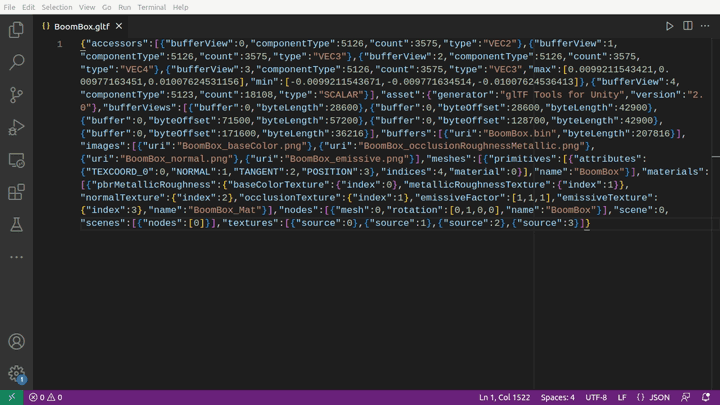
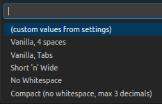
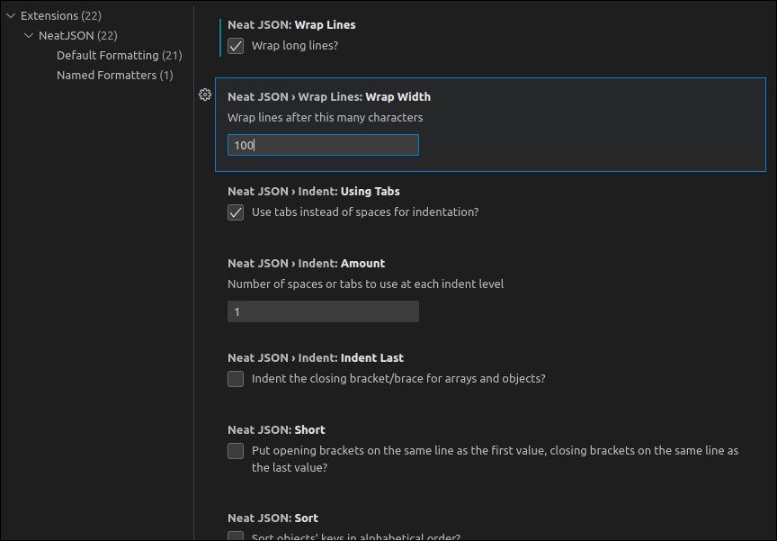
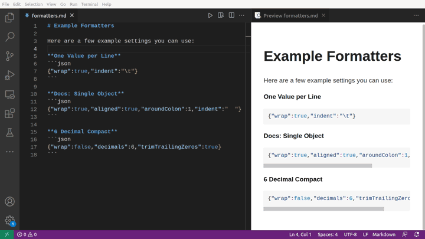

A flexible formatter for JSON with a large number of configuration options.




## Features

* Reformat an entire document, or just a selection of JSON/JSONC/JSON5/JS
* Save sets of formatting options and easily switch between them. For example:
  * One setting to make file sizes as small as possible, reducing float precision.
  * Another setting to make it easy to read, sorting object keys and aligning values.
  * One setting for inline documentation, wrapping to only 60 characters wide.
* Visit http://phrogz.net/JS/NeatJSON/ for a live example of the formatting
  options available.


## Available Commands

* `NeatJSON: Format Document` —
  Reformats the entire document using the current formatting settings.
  Only available if the document format is `JSON` (not `JSONC`).
* `NeatJSON: Format Selection` —
  Reformats the selected text as JSON, using the current formatting settings.
* `NeatJSON: Format With…` —
  Format the current document or selection, picking a different predefined
  formatting setting to use. The new formatting settings will be used for
  future commands (unless this command is invoked again).  
  


## Formatting Settings



The "Default Formatting" settings group provides control over what formatting is
applied by default, when no other predefined formatting settings have been selected.
Each of the 22 options has an explanation describing its use.
If the descriptions are not clear, perhaps try
[the online version of NeatJSON](http://phrogz.net/JS/NeatJSON/) and play with
the options there on some sample data.

You can also create your own custom named formatters:



To create your own named presets, find the "Neat JSON: Formatters" setting in the
"Named Formatters" section of the settings  and click on "Edit in settings.json".

By default your settings will be populated with the example named formatters that
ship with the extension. You can add your own predefined settings to this object.
See [the options described here](https://github.com/Phrogz/NeatJSON/blob/master/README.md#options)
for details on the settings you can use.

If you do not want some of the predefined names and delete them, they will still
show up due to the way VS Code's settings work (merging defaults with your overrides).
To remove the predefined settings, you must set them to have the key/value `"hide":true`.
For example, the following will hide all predefined and show only those you add:

```jsonc
"neatJSON.formatters": {
    "Vanilla, 4 spaces"                       : {"hide":true},
    "Vanilla, Tabs"                           : {"hide":true},
    "Short 'n' Wide"                          : {"hide":true},
    "No Whitespace"                           : {"hide":true},
    "Compact (no whitespace, max 3 decimals)" : {"hide":true},
    // your settings here
},
```


## Release Notes

### v0.7 (2023-Mar-17)

Parse JSON5 as the source (unquoted object keys, trailing commas, comments,
single-quoted strings, etc.) instead of only accepting JSON.


### v0.6.2 (2023-Mar-17)

First published release that actually works. (Oops.)


### v0.6.0 (2023-Mar-16)

Supports formatting multiple selections at the same time.


### v0.5.0 (2023-Mar-15)

Initial release.
